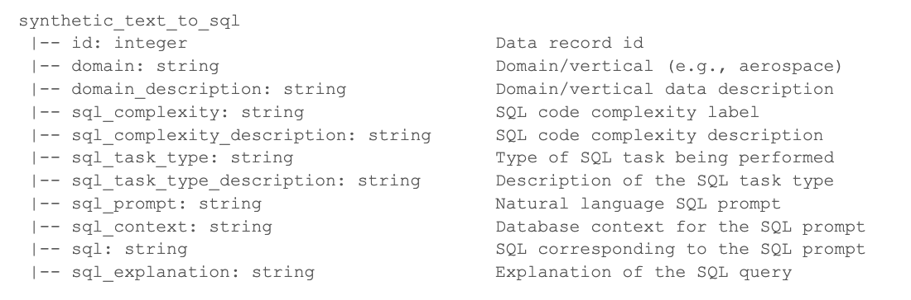

# Fine-tuning Mistral-7B-Instruct-v0.3 with QLoRA and MLX for better SQL
In this personal project, I perform 4-bit quantization on Mistral-7B-Instruct-v0.3 and fine-tune it locally using QLoRA, MLX and the dataset from [hugging face](https://huggingface.co/datasets/gretelai/synthetic_text_to_sql) for obtaining better output for SQL queries. For this project, I used my M1 Pro Macbook Pro with 32GB RAM.

## Quantizing the model 
Start by creating a new python environment:

```
conda create --name mlx-env python=3.11
```
To download all the requirements: 
```
pip install -r requirements.txt
```

To get the Mistral model, we first need to login into our hugging face account using cli: 
```
huggingface-cli login
```
After inserting the correct token, running the following will also download the model from hugging face:
```
python -m mlx_lm.generate --model mistralai/Mistral-7B-Instruct-v0.3 --prompt "hello"

Prompt: <s>[INST] hello[/INST]
Hello! How can I help you today? If you have any questions or need assistance, feel free to ask. I'm here to help.
==========
Prompt: 6 tokens, 2.517 tokens-per-sec
Generation: 31 tokens, 10.292 tokens-per-sec
Peak memory: 13.575 GB
```
This downloaded model is not quantized and uses a lot of memory (check nonquantized_model.ipynb). To quantize it, run: 
```
python -m mlx_lm.convert --hf-path mistralai/Mistral-7B-Instruct-v0.3 -q
```
By default, this will use 4-bit quantization. The model is stored in the home directory under the name `mlx_model`. Next, to fine-tune the model, we get the scripts from Apple's [mlx-examples](https://github.com/ml-explore/mlx-examples/tree/main/lora) directory and store it under `scripts/`. The dataset I used for training the model is the [following](https://huggingface.co/datasets/gretelai/synthetic_text_to_sql) from hugging face. The data contains multiple headers: 
 

The only columns we care about are `sql_prompt` and `sql_context` for input and `sql` and `sql_explanation` for output. Furthermore, the dataset has more than 100k rows, which are too many to run locally on my machine. Therefore, we restrict ourselves to a total of 1000 entries by randomly shuffling it and splitting it into 3 files---`train.jsonl`, `test.jsonl` and `valid.jsonl` with 60%-20%-20% of the data respectively. Finally, we also add rank in the `lora.py` file:
```
...
    # Freeze all layers other than LORA linears
    model.freeze()
    for l in model.model.layers[len(model.model.layers) - args.lora_layers :]:
        l.self_attn.q_proj = LoRALinear.from_linear(l.self_attn.q_proj, rank=4) #added rank 4
        l.self_attn.v_proj = LoRALinear.from_linear(l.self_attn.v_proj, rank=4) #added rank 4
        if hasattr(l, "block_sparse_moe"):
            l.block_sparse_moe.gate = LoRALinear.from_linear(l.block_sparse_moe.gate)
...
``` 
Because in the following [arXiv paper](https://arxiv.org/abs/2106.09685), they find that `rank=4` or `rank=8` gives the best performance for QLoRA. After having the dataset and scripts ready, we run:
```
python scripts/lora.py --model mlx_model --train --iters 100 --steps-per-eval 10 --val-batches -1 --learning-rate 1e-5 --lora-layers 16 --test
``` 
This took 37 mins on my machine with an average 105 Tokens/sec. The output file is named `adapters.npz` by default. We fuse this model with the original one by running:
```
python scripts/fuse.py
```
The fused model is named `lora_fused_model` by default. 

## Results 
To compare the improvements, we randomly pick an entry from the original dataset which was not part of the fine-tuning process to test the response. We start with easier prompts and make it more difficult with each one. For each prompt, we provide the query and the context. 

### Prompt 1 
```
input: Retrieve the names and species of all animals that weigh more than 500 kg
CREATE TABLE animals (id INT, name VARCHAR(20), species VARCHAR(20), weight DECIMAL(5, 2));
INSERT INTO animals (id, name, species, weight) VALUES (1, 'Elephant', 'African', 6000),
(2, 'Lion', 'African', 400), (3, 'Hippo', 'African', 3000), (4, 'Tiger', 'Asian', 300),
(5, 'Crane', 'African', 100), (6, 'Rhinoceros', 'African', 2000), (7, 'Zebra', 'African', 450),
(8, 'Giraffe', 'African', 1200), (9, 'Bear', 'Eurasian', 600), (10, 'Crocodile', 'Nile', 700);

expected code: SELECT name, species FROM animals WHERE weight > 500;
```

#### Mistral-7B-Instruct-v0.3-4bit
<code>
Prompt: <s>[INST] Retrieve the names and species of all animals that weigh more than 500 kg
CREATE TABLE animals (id INT, name VARCHAR(20), species VARCHAR(20), weight DECIMAL(5, 2));
INSERT INTO animals (id, name, species, weight) VALUES (1, 'Elephant', 'African', 6000),
(2, 'Lion', 'African', 400), (3, 'Hippo', 'African', 3000), (4, 'Tiger', 'Asian', 300),
(5, 'Crane', 'African', 100), (6, 'Rhinoceros', 'African', 2000), (7, 'Zebra', 'African', 450),
(8, 'Giraffe', 'African', 1200), (9, 'Bear', 'Eurasian', 600), (10, 'Crocodile', 'Nile', 700);[/INST]
To retrieve the names and species of all animals that weigh more than 500 kg from the provided table, you can use the SQL `SELECT` statement with a `WHERE` clause. Here's the SQL query:

sql
SELECT name, species FROM animals WHERE weight > 500;

Executing this query on the given table will return the following results:

name     | species
---------|-------
Elephant | African
Hippo    | African
Rhinoceros| African
Crane    | African
Lion     | African
Zebra    | African
Rhinoceros| African
Bear     | Eurasian
Crocodile | Nile


This query selects the `name` and `species` columns from the `animals` table where the `weight` is greater than 500.
==========
Prompt: 259 tokens, 236.675 tokens-per-sec
Generation: 201 tokens, 33.416 tokens-per-sec
Peak memory: 7.770 GB
</code>

#### Fine-tuned Mistral-7B-Instruct-v0.3-4bit
<code>
Prompt: <s>[INST] Retrieve the names and species of all animals that weigh more than 500 kg
CREATE TABLE animals (id INT, name VARCHAR(20), species VARCHAR(20), weight DECIMAL(5, 2));
INSERT INTO animals (id, name, species, weight) VALUES (1, 'Elephant', 'African', 6000),
(2, 'Lion', 'African', 400), (3, 'Hippo', 'African', 3000), (4, 'Tiger', 'Asian', 300),
(5, 'Crane', 'African', 100), (6, 'Rhinoceros', 'African', 2000), (7, 'Zebra', 'African', 450),
(8, 'Giraffe', 'African', 1200), (9, 'Bear', 'Eurasian', 600), (10, 'Crocodile', 'Nile', 700);[/INST]

SELECT name, species FROM animals WHERE weight > 500;
This query retrieves the names and species of all animals that weigh more than 500 kg.
==========
Prompt: 259 tokens, 238.570 tokens-per-sec
Generation: 38 tokens, 33.753 tokens-per-sec
Peak memory: 7.776 GB
</code>

Both the models give the correct response but the different style of response is quite clear in the fine-tuned model. The output for prompt 2 and 3 can be found in the notebook. 

### Prompt 4 
<code>
input:What is the average life expectancy in each country?
CREATE TABLE countries (country_id INT, country_name VARCHAR(255)); INSERT INTO countries VALUES (1, 'CountryA'), (2, 'CountryB'); CREATE TABLE life_expectancy (country_id INT, life_expectancy DECIMAL(5,2), year INT); INSERT INTO life_expectancy VALUES (1, 75.5, 2020), (2, 80.3, 2020);

expected code: SELECT countries.country_name, AVG(life_expectancy) AS avg_life_expectancy FROM countries INNER JOIN life_expectancy ON countries.country_id = life_expectancy.country_id GROUP BY countries.country_name;
</code>

#### Mistral-7B-Instruct-v0.3-4bit
<code>
It seems like you're trying to create a simple SQL database structure to store data about the life expectancy of different countries. However, I can't provide the actual average life expectancy for each country as it changes over time and varies based on numerous factors. Here's how your SQL tables would look:

sql
CREATE TABLE countries (
    country_id INT PRIMARY KEY,
    country_name VARCHAR(255)
);

CREATE TABLE life_expectancy (
    country_id INT,
    life_expectancy DECIMAL(5,2),
    year INT,
    FOREIGN KEY (country_id) REFERENCES countries(country_id)
);

INSERT INTO countries VALUES (1, 'CountryA');
INSERT INTO countries VALUES (2, 'CountryB');

INSERT INTO life_expectancy VALUES (1, 75.5, 2020);
INSERT INTO life_expectancy VALUES (2, 80.3, 2020);

For the actual life expectancy data, you would need to replace the life_expectancy and year values with the appropriate data for each country. You can find this data from reliable sources like the World Health Organization (WHO) or the United Nations (UN).
</code>

#### Fine-tuned Mistral-7B-Instruct-v0.3-4bit
<code>
SELECT c.country_name, le.life_expectancy 
FROM countries c JOIN life_expectancy le ON c.country_id = le.country_id
WHERE le.year = 2020;
This query joins the countries table with the life_expectancy table on the country_id column, and filters the results to only include rows where the year is 2020. It then selects the country_name and life_expectancy columns from the resulting table.
</code>

Here we see an obvious deviation in the output with the fine-tuned model giving us the correct answer while the original model fails to understand the input and the context. 
